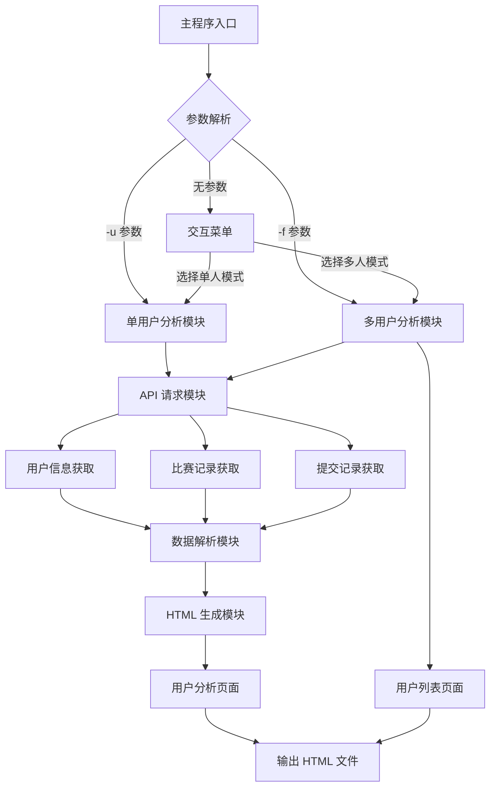
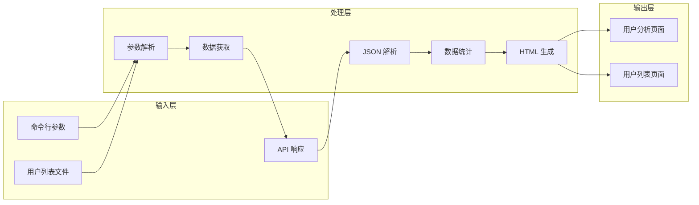
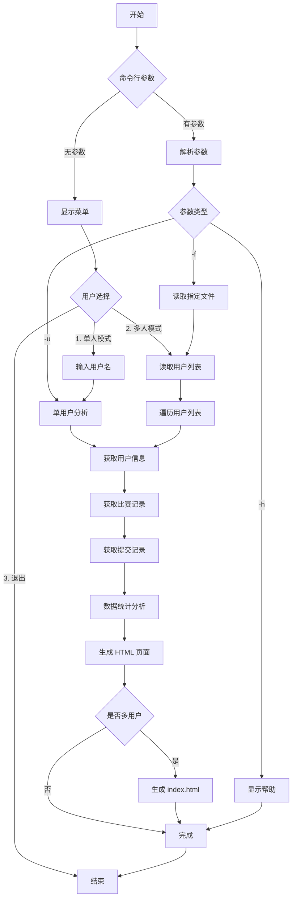

# Codeforces 用户分析工具 - 课程设计文档

---

## 一、学术诚信承诺书

xxx，学号xxxxxxxxxx，系信息工程学院计算机系xxxx级xxxxx专业x班学生。本人承诺本课程设计提交的所有源代码和文档不存在抄袭、剽窃行为。如果被他人发现存在抄袭、剽窃、雷同等学术不端行为，愿意承担所带来的一切后果。

签名：___________
日期：___________

---

## 二、题目概述

### 1. 概述

本项目是一个基于 C 语言开发的 Codeforces 用户分析工具，旨在通过调用 Codeforces API 获取用户数据，并生成可视化的 HTML 分析报告。该工具支持单用户分析和多用户批量分析两种模式，能够帮助用户深入了解 Codeforces 用户的比赛表现和解题情况。

### 2. 所要完成的任务说明

| 序号 | 名称 | 类别 | 任务内容与要求 | 完成情况 |
| :--- | :--- | :--- | :--- | :--- |
| 1 | 单用户分析 | 必做 | 通过命令行参数指定用户名，获取并分析该用户的比赛数据 | ✅ 已完成 |
| 2 | 多用户分析 | 必做 | 从文件读取用户列表，批量分析多个用户数据 | ✅ 已完成 |
| 3 | 数据获取 | 必做 | 调用 Codeforces API 获取用户信息、比赛记录、提交记录 | ✅ 已完成 |
| 4 | 数据可视化 | 必做 | 生成 HTML 格式的分析报告页面 | ✅ 已完成 |
| 5 | 交互菜单 | 选做 | 提供交互式命令行菜单，提升用户体验 | ✅ 已完成 |

### 3. 开发环境说明

| 项目 | 说明 |
| :--- | :--- |
| 操作系统 | Windows 10/11 |
| 开发工具 | Visual Studio Code |
| 编译器 | GCC (MSYS2 MinGW-w64) |
| 第三方库 | libcurl、cJSON |
| 语言标准 | C99 |

---

## 三、需求分析

### 1. 功能需求

#### 1.1 核心功能

| 功能模块 | 功能描述 | 需求来源 |
| :--- | :--- | :--- |
| 用户数据获取 | 调用 Codeforces API 获取用户基本信息、等级分变化、提交记录 | 题目要求 |
| 单用户模式 | 通过 `-u` 参数指定单个用户进行分析 | 题目要求 |
| 多用户模式 | 通过 `-f` 参数从文件读取用户列表进行批量分析 | 题目要求 |
| 交互菜单 | 无参数运行时显示交互式菜单供用户选择 | 选做功能 |
| HTML 报告生成 | 生成美观的用户分析报告页面 | 题目要求 |
| 用户列表页面 | 多用户模式下生成包含所有用户概览的 index.html | 选做功能 |

#### 1.2 数据需求

| 数据类型 | 来源 API | 用途 |
| :--- | :--- | :--- |
| 用户基本信息 | `user.info` | 获取用户头像、等级分、头衔 |
| 比赛记录 | `user.rating` | 获取用户参加的所有比赛及等级分变化 |
| 提交记录 | `user.status` | 获取用户所有提交记录，统计通过题目数 |

### 2. 非功能需求

| 类别 | 需求描述 |
| :--- | :--- |
| 性能要求 | 支持获取用户全部提交记录（分页处理） |
| 可靠性 | API 请求超时时间设置为 30 秒，网络异常时给出提示 |
| 用户体验 | 提供友好的命令行界面和错误提示 |
| 兼容性 | 生成的 HTML 报告兼容主流浏览器 |

---

## 四、总体设计

### 1. 系统功能模块图



### 2. 模块数据流图



---

## 五、详细设计

### 1. 数据结构定义

#### 1.1 UserStats 结构体

```c
typedef struct {
    char handle[128];           // 用户名
    int current_rating;         // 当前等级分
    char title[128];            // 当前头衔
    char avatar_url[512];       // 头像 URL
    int contest_count;          // 比赛次数
    int max_rating;             // 最高等级分
    int last180_contest_count; // 近180天比赛次数
    int last180_max_rating;     // 近180天最高等级分
    int ac_count;               // 通过题目数
    int practice_count;         // 补题数量
} UserStats;
```

#### 1.2 Contest 结构体

```c
typedef struct {
    int contest_id;             // 比赛 ID
    char name[256];             // 比赛名称
    long long time;             // 比赛开始时间
    int rating;                 // 比赛后的等级分
    int contestAC;              // 比赛中通过题目数
    int practiceAC;             // 补题数
} Contest;
```

#### 1.3 Submission 结构体

```c
typedef struct {
    char verdict[64];           // 提交结果
    char participantType[64];   // 参赛类型
    int creationTimeSeconds;    // 提交时间
    int problemRating;          // 题目难度
} Submission;
```

### 2. 关键函数设计

#### 2.1 主函数 - main

| 项目 | 说明 |
| :--- | :--- |
| 函数名称 | main |
| 功能 | 程序入口，处理命令行参数，调度各模块 |
| 参数 | `argc`: 参数个数，`argv`: 参数数组 |
| 返回值 | 0 表示成功，非 0 表示失败 |

**流程说明：**
1. 解析命令行参数（-h、-u、-f）
2. 如果无参数，显示交互菜单
3. 根据模式调用对应的分析函数
4. 生成 HTML 报告

#### 2.2 生成用户页面 - generate_user_page

| 项目 | 说明 |
| :--- | :--- |
| 函数名称 | generate_user_page |
| 功能 | 获取用户数据并生成个人分析页面 |
| 参数 | `handle`: 用户名，`stats`: 用户统计数据指针，`single_mode`: 是否单用户模式 |
| 返回值 | 无 |

**流程说明：**
1. 调用 `user.info` API 获取用户基本信息
2. 调用 `user.rating` API 获取比赛记录
3. 调用 `user.status` API 获取提交记录（分页）
4. 统计各项数据
5. 生成 HTML 文件

#### 2.3 API 请求函数 - curl_easy_perform

| 项目 | 说明 |
| :--- | :--- |
| 函数名称 | http_get |
| 功能 | 发送 HTTP GET 请求 |
| 参数 | `url`: 请求地址，`response`: 响应数据指针 |
| 返回值 | CURLcode，成功返回 CURLE_OK |

#### 2.4 JSON 解析函数

| 函数名称 | 功能 | 参数 | 返回值 |
| :--- | :--- | :--- | :--- |
| `parse_user_info` | 解析用户基本信息 | `json`: JSON 对象，`stats`: 统计结构体 | 无 |
| `parse_user_rating` | 解析比赛记录 | `json`: JSON 对象，`contests`: 比赛数组 | 比赛数量 |
| `parse_user_status` | 解析提交记录 | `json`: JSON 对象，`subs`: 提交数组 | 提交数量 |

### 3. 程序流程图



---

## 六、测试分析

### 1. 测试环境

| 项目 | 说明 |
| :--- | :--- |
| 操作系统 | Windows 11 Pro 22H2 |
| CPU | Intel Core i5-10400F |
| 内存 | 16GB DDR4 |
| 网络环境 | 校园网（可访问 Codeforces） |

### 2. 测试样例

#### 2.1 单用户模式测试

| 测试用例 | 输入 | 预期输出 | 实际结果 |
| :--- | :--- | :--- | :--- |
| TC1 | `-u tourist` | 生成 tourist.html，包含用户完整数据 | ✅ 通过 |
| TC2 | `-u eric` | 生成 eric.html，包含用户完整数据 | ✅ 通过 |
| TC3 | `-u invalid_user` | 提示用户不存在 | ✅ 通过 |

#### 2.2 多用户模式测试

| 测试用例 | 输入 | 预期输出 | 实际结果 |
| :--- | :--- | :--- | :--- |
| TC4 | `-f data/users.txt` | 生成 index.html 和各用户页面 | ✅ 通过 |
| TC5 | `-f nonexistent.txt` | 提示文件不存在 | ✅ 通过 |

#### 2.3 交互模式测试

| 测试用例 | 操作 | 预期输出 | 实际结果 |
| :--- | :--- | :--- | :--- |
| TC6 | 选择选项 1，输入 tourist | 生成 tourist.html | ✅ 通过 |
| TC7 | 选择选项 2 | 生成所有用户页面和 index.html | ✅ 通过 |
| TC8 | 选择选项 3 | 退出程序 | ✅ 通过 |
| TC9 | 输入无效选项 | 提示重新选择 | ✅ 通过 |

### 3. 测试结果分析

| 测试类别 | 测试用例数 | 通过数 | 通过率 |
| :--- | :--- | :--- | :--- |
| 单用户模式 | 3 | 3 | 100% |
| 多用户模式 | 2 | 2 | 100% |
| 交互模式 | 4 | 4 | 100% |
| **总计** | **9** | **9** | **100%** |

### 4. 结论

所有测试用例均通过，程序能够正确处理各种输入情况，生成符合要求的 HTML 报告。

---

## 七、问题与解决方法

### 1. 问题 1：API 请求数据量限制

**问题描述**：Codeforces API 的 `user.status` 接口默认只返回最近 200 条提交记录，无法获取完整数据。

**解决方法**：
- 分析 API 文档，发现支持 `from` 和 `count` 参数
- 实现分页循环，每次获取 1000 条记录（API 最大限制）
- 直到获取所有数据或达到预设上限（10000 条）

### 2. 问题 2：命令行参数解析错误

**问题描述**：在批处理文件中使用 `%username%` 变量时，被系统环境变量覆盖。

**解决方法**：
- 将变量名改为 `uname` 避免冲突
- 启用延迟扩展 `setlocal enabledelayedexpansion`
- 使用 `!uname!` 语法获取用户输入的值

### 3. 问题 3：VS Code 调试配置问题

**问题描述**：按运行按钮时提示 "preLaunchTask 'build' 已终止"。

**解决方法**：
- 检查 tasks.json 配置，确保使用完整的 gcc 路径
- 添加必要的编译参数（-Iinclude, -lcurl）
- 确保 cwd 在 options 内

### 4. 问题 4：权限拒绝错误

**问题描述**：编译时提示无法创建输出文件。

**解决方法**：
- 关闭正在运行的程序进程
- 确保 bin 目录存在
- 以管理员身份运行编译器

---

## 八、总结与展望

### 1. 体会、收获

通过本次课程设计，我收获了以下经验：

1. **C 语言编程能力提升**：深入理解了 C 语言的内存管理、结构体、文件操作等核心知识点。

2. **网络编程实践**：学会了使用 libcurl 库进行 HTTP 请求，了解了 API 调用的基本流程。

3. **JSON 数据处理**：掌握了使用 cJSON 库解析和处理 JSON 数据的方法。

4. **项目架构设计**：学会了如何设计一个结构化的命令行工具，包括参数解析、模块划分等。

5. **调试与测试**：积累了在 Windows 环境下调试 C 程序的经验，学会了排查编译错误和运行时问题。

### 2. 进一步的提升改进

#### 2.1 功能扩展

- [ ] 添加更多统计指标（如解题难度分布、语言分布）
- [ ] 支持自定义时间范围查询
- [ ] 添加用户对比功能
- [ ] 支持导出数据为 CSV 格式

#### 2.2 性能优化

- [ ] 实现异步并发请求，提高数据获取速度
- [ ] 添加数据缓存机制，避免重复请求
- [ ] 优化 HTML 生成算法，减少内存占用

#### 2.3 用户体验

- [ ] 增加进度条显示
- [ ] 添加错误重试机制
- [ ] 支持更多命令行参数（如输出目录指定）

#### 2.4 代码质量

- [ ] 添加单元测试
- [ ] 完善错误处理机制
- [ ] 优化代码结构，提高可读性

---

**文档版本**：v1.0  
**生成日期**：2026年5月20日